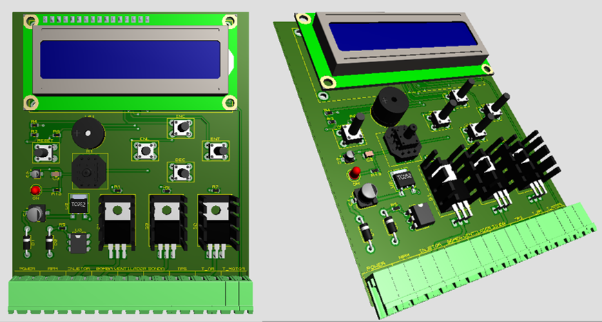
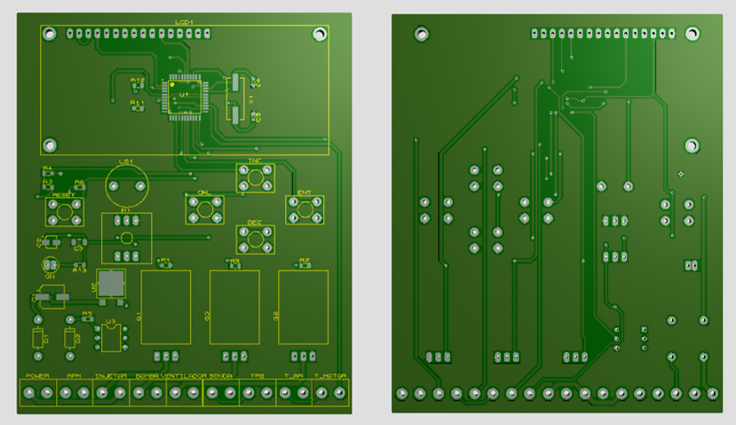
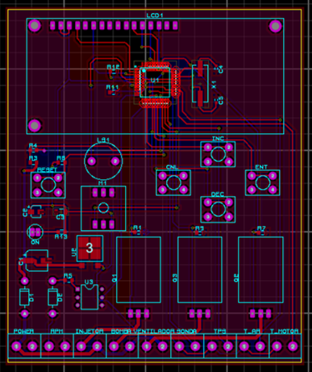
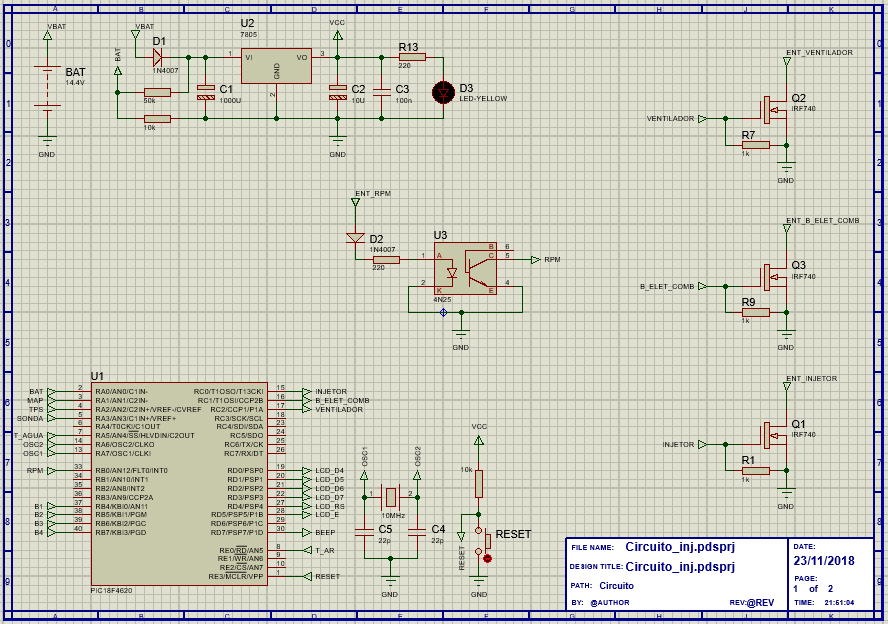
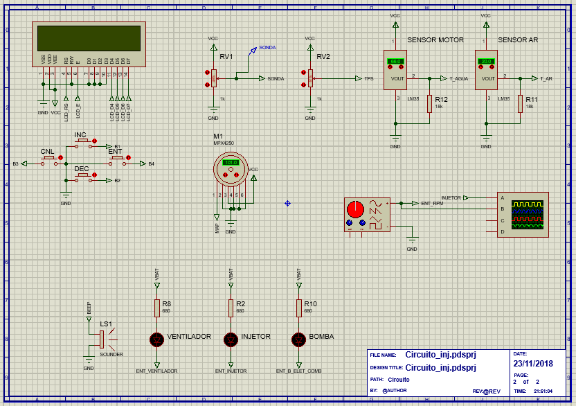

# Injeção Eletrônica Configurável

Desenvolvido com microcontrolador PIC18F4620.

Injeção mono-ponto.

Controle PID para o tempo de abertura dos injetores.

Speedy-Density.

Combustível Álcool ou Gasolina.

Controle de temperatura.

Sonda Lambda.

Informa: RPM, PRESSÃO ABSOLUTA, SONDA LAMBDA, TEMP. DO MOTOR, TEMP. DO AR, TENSÃO DA BATERIA, TPS, TEMPO DE INJEÇÃO (ms e %), PATAMARES MÁXIMOS ATINGIDOS e ALERTA DE EXCESSO DA TEMPERATURA.

Configurável: Nº CILINDROS, VOLUME DO MOTOR, ACIONAMENTO DO VENTILADOR, VAZÃO DO INJETOR, TIPO DE COMBUSTÍVEL, TIPO DE REFRIGERAÇÃO, DEADTIME DO INJETOR e CUT-OFF.
Dados armazenados na EEPROM.

  
  
  
  
  

